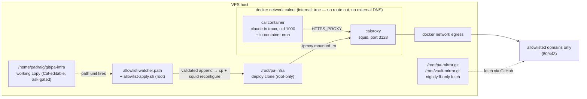

# Cal — system architecture

How Cal (the `pa` assistant) runs, what protects what, and where the levers
are. This is the maintenance reference; the design *rationale* and audit trail
live in `pa/research/phase2-container-design.md`. Current as of the Phase 2
cutover, 2026-08-10.

## The system in one paragraph

Cal is a Claude Code session running in a Docker container on the VPS, driven
through Telegram. The container sits on an internal network with **no route to
the internet**; every outbound request goes through a squid proxy that only
permits an explicit domain allowlist. Cal can edit its own infrastructure
repo (this one) and its own egress allowlist, but every change passes through
a deterministic gate — a Telegram approval, a root-owned validator, or a
human-reviewed deploy — before it takes effect. Root-owned mirrors and a
read-only deploy key mean that even a fully compromised Cal cannot rewrite
history, reach host credentials, or widen its own cage.

## Threat model

Cal reads untrusted external content (web pages, podcast feeds, search
results) with real credentials in hand, so prompt injection is assumed to
*succeed* eventually. The design goal, in Pádraig's words: **"a fully
successful injection can, at worst, annoy me."**

- **Deterministic controls over model judgment.** Network topology, file
  ownership, and byte-level validation do the enforcing; Cal's own judgment is
  a convenience layer, not a boundary.
- **Gmail is permanently out of scope.** Cal never touches it and holds no
  Google credentials (sole exception: the calendar-scoped gcal token).
- **Agency is preserved on purpose.** Cal keeps low-stakes credentials,
  autonomous tool-building, and self-service workflows (allowlist appends,
  schedule edits) gated by Telegram approvals — SSH is reserved for genuinely
  security-relevant changes.

## Topology

Mounts into the cal container (uid 1000 inside = `padraig` outside, so no
privilege change rides a bind mount):

| Host path | In container | Purpose |
|---|---|---|
| `/home/padraig/cal-home` | `/home/cal` | Cal's home: `.claude`, session state, low-stakes creds. Never in git. |
| `/home/padraig/git/pa` | `/home/cal/pa` | Cal's main repo: prompts, scripts, `schedule.cron`, settings. |
| `/home/padraig/git/Obsidian-Vault-PMK` | `/home/cal/vault` | The vault. |
| `/home/padraig/git/pa-infra` | `/home/cal/pa-infra` | This repo — Cal's **working copy** (edits are ask-gated). |

Deliberately *not* reachable from the container: `~/.ssh`, host `~/.claude`,
`/root` (deploy clone, mirrors), `/etc`, docker and tailscale sockets.
Tailscale ACLs additionally stop the VPS initiating connections to the tailnet.

## Components

### `cal` container (`cal/Dockerfile`, `cal/entrypoint.sh`)

Ubuntu 26.04. Tools (claude-code, qmd, bun, uv) install to `/usr/local`
because `/home/cal` is shadowed by the bind mount at runtime. `TZ` is baked
in as Europe/London (ENV + `/etc/localtime`) so `date` is right in every
subprocess. The entrypoint (PID 1, root):

1. Installs Cal's crontab from `/home/cal/pa/schedule.cron` and re-installs it
   whenever the file's mtime changes (30 s loop). Scheduling is *not* a
   security boundary — a scheduled Cal has the same authority as a running one.
2. Deletes `channels/telegram/bot.pid` — stale by definition after a restart,
   and container pid recycling makes the plugin's stale-check dangerous
   (see sharp edges).
3. Starts claude as user `cal` in a tmux session named `cal`, with
   `$CLAUDE_ARGS` from compose: auto permission mode, `--continue`, the
   Telegram channel plugin.
4. Keepalive loop while the tmux session lives; `restart: unless-stopped`
   revives the container if it dies.

### `calproxy` (`proxy/squid.conf`, `proxy/allowed-domains.txt`)

Stock `ubuntu/squid` image. Deny-by-default: only domains in
`allowed-domains.txt`, only ports 80/443, `CONNECT` only to 443. No caching.
It mounts `./proxy` **from the deploy clone** read-only — the running
allowlist is always root's copy, never Cal's working copy. The whole
directory is mounted, not single files (single-file bind mounts pin inodes
and go stale on in-place replacement).

Because `calnet` is `internal: true` there is also **no external DNS** inside
the cal container — squid resolves names itself on the egress side. DNS
tunneling is closed by topology, not policy.

### Networks

- `calnet` — `internal: true`. cal + proxy only. No gateway out.
- `egress` — normal bridge. Proxy only.

## Trust boundaries — who can write what

| Actor | Can write | Cannot write |
|---|---|---|
| **Cal** (uid 1000, in container) | `pa`, vault, `cal-home`, pa-infra **working copy** (ask-gated) | deploy clone, watcher units/validator, mirrors, anything under `/root` or host `/etc` |
| **Root watcher** | deploy-clone `allowed-domains.txt` (only via validated append) | everything else — it copies one file and reloads squid |
| **Root (human/SSH session)** | everything, via reviewed `deploy.sh` | — |

**The two-copies rule** is the heart of it: Cal edits
`/home/padraig/git/pa-infra` and pushes; only root's `/root/pa-infra` clone is
ever executed or mounted. The path from Cal's edit to running config is
either (a) the allowlist watcher, which enforces a byte-level contract, or
(b) a human reading `git log -p` and running `deploy.sh`.

## Egress: adding a domain

1. Cal appends the domain to `proxy/allowed-domains.txt` in its working copy.
   The file is ask-gated, so this surfaces as a **Telegram approval prompt**.
2. The systemd path unit (`allowlist-watcher.path`) fires
   `/root/pa-infra/host/allowlist-apply.sh` — the root-clone copy, so Cal can
   never edit the validator that gates it.
3. The validator applies the change **iff**: the deployed file is an exact
   byte prefix of the working copy (append-only — any edit or deletion of an
   existing line fails), and every added line is blank, a comment, or matches
   `^\.?([a-z0-9-]+\.)+[a-z]{2,}$`. Anything else is logged to
   `/var/log/cal-allowlist.log` and ignored.
4. On pass: copy to the deploy clone + `squid -k reconfigure`. Live in ~3 s.
5. Cal commits and pushes the append so the repo matches reality.

Removing or editing entries is deliberately manual: change the file, review,
`deploy.sh`. Manual single-domain add (fallback):
`sudo /root/pa-infra/scripts/allow-domain.sh api.example.com`.

## Git, credentials, history protection

- **Cal's PAT** (fine-grained, no expiry): Contents r/w on `pa`,
  `Obsidian-Vault-PMK`, `pa-infra` only. Lives in
  `/home/cal/.git-credentials` (mode 600, deny-ruled in settings). Out-of-
  scope repos are invisible to it ("not found"), verified deterministically.
  **A Contents r/w PAT does not block force-pushes** — history protection
  comes from the mirrors, not the token.
- **Root mirrors**: `/root/vault-mirror.git` (00:30) and `/root/pa-mirror.git`
  (00:35) do nightly `fetch origin master:master` — fast-forward only, never
  forced. A legitimate `git revert` propagates (it's a new commit); a hostile
  history rewrite is refused and the mirror keeps true history. Log:
  `/var/log/pa-mirror.log`.
- **Deploy clone**: read-only GitHub deploy key (`~/.ssh/pa-infra-deploy`,
  ssh alias `pa-infra-github`).
- **Push path**: the host has no GitHub credentials for these repos — pushes
  happen from inside the container as Cal
  (`docker exec -u cal cal git -C /home/cal/<repo> push`).

## In-session permissions (`pa/.claude/settings.json`)

Auto permission mode: **deny** rules hold unconditionally, **ask** rules relay
to Telegram as approval prompts, the classifier gates the rest.

- Deny reads: `/home/cal/.ssh/**`, `.claude/.credentials.json`,
  `channels/telegram/.env`, `.git-credentials`.
- Ask on writes: anything under `/home/cal/pa-infra/**`, `schedule.cron`,
  `settings.json` itself.

## Scheduling

In-container cron, installed from `pa/schedule.cron` (ask-gated, so schedule
changes get Telegram approval). `CRON_TZ=Europe/London` — all times in the
file are London-local. Jobs run `cd /home/cal/pa && uv run cal-prompt <name>`
plus the vault backup, qmd indexing, and maintenance jobs. The entrypoint
re-installs the crontab on file change; no container restart needed.

## Runbook

- **Deploy a change** (anything beyond allowlist appends): review
  `git -C /root/pa-infra log -p ..origin/main`, then
  `sudo /root/pa-infra/scripts/deploy.sh`.
- **Add an egress domain**: Cal appends + Telegram approval + watcher (above).
- **Check the watcher**: `tail /var/log/cal-allowlist.log`;
  `systemctl status allowlist-watcher.path`.
- **See what squid is blocking**: `docker logs calproxy` (access log tails to
  stdout; denied requests show `TCP_DENIED`).
- **Telegram silent?** Three known causes, in the order to check them —
  see sharp edges below.
- **Python env broken after image rebuild**: run `uv sync` (or
  `rm -rf .venv && uv sync`) *inside* the container — host-built venvs
  dangle (uv's CPython lives in the host home).
- **Rollback (until ~2026-08-24)**: `docker compose down` in `/root/pa-infra`;
  `systemctl start cal.service`; restore host crontab from
  `~/crontab.backup-20260810`.
- **Restore after hostile force-push**: the root mirrors hold true history —
  push it back from there.

## Sharp edges (learned the hard way, 2026-08-10)

1. **Never set `CLAUDE_CODE_DISABLE_NONESSENTIAL_TRAFFIC` for Cal.** The
   Telegram channels feature is gated on that "nonessential" statsig flag
   traffic; with it set, channels report "not currently available".
2. **`bot.pid` + pid recycling.** The telegram plugin SIGTERMs whatever pid is
   in `channels/telegram/bot.pid` as a "stale poller". After a container
   restart that pid is often a fresh innocent process — sometimes the
   plugin's own. The entrypoint deletes the file every boot.
3. **`mcp-needs-auth-cache.json` poisoning.** A crashed plugin connection gets
   recorded as needing auth, after which claude *silently never retries it*
   across restarts. Recovery: remove the `plugin:telegram:telegram` key from
   `~/.claude/mcp-needs-auth-cache.json` (leave connector entries intact).
4. **The plugin drops pre-startup Telegram messages** (anti-replay). "Update
   consumed but no reply" usually means the message arrived before the plugin
   was up — send a fresh one.
5. **Single-file bind mounts pin inodes.** `sed -i` or git on the host leaves
   the container reading the old inode forever. Mount directories.
6. **squid 6 quirks**: `cache_dir null` is gone; it cannot open `/dev/stdout`
   after dropping privileges — log to `/var/log/squid/` and let the image
   entrypoint tail it.
7. **Watcher vs `git pull` in the deploy clone.** The watcher legitimately
   dirties `proxy/allowed-domains.txt` in `/root/pa-infra`; `deploy.sh`
   handles this by checking out the file before pulling and re-running the
   validator after, so uncommitted-but-approved appends survive a deploy.
