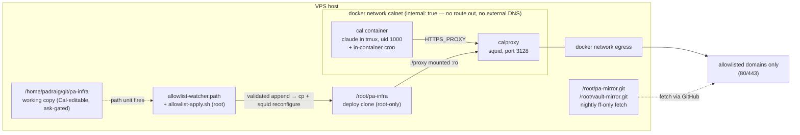

# Cal — system architecture

How Cal (the `pa` assistant) runs, what protects what, and where the levers
are. This is the maintenance reference; the design *rationale* and audit trail
live in `pa/research/phase2-container-design.md`. Current as of the Phase 2
cutover, 2026-08-10.

## The system in one paragraph

Cal is a Claude Code session running in a Docker container on the VPS, driven
through Telegram. The container sits on an internal network with **no route to
the internet**; every outbound request goes through a squid proxy that only
permits an explicit domain allowlist. Cal can edit its own infrastructure
repo (this one) and its own egress allowlist, but every change passes through
a deterministic gate — a Telegram approval, a root-owned validator, or a
human-reviewed deploy — before it takes effect. Root-owned mirrors and a
read-only deploy key mean that even a fully compromised Cal cannot rewrite
history, reach host credentials, or widen its own cage.

## Threat model

Cal reads untrusted external content (web pages, podcast feeds, search
results) with real credentials in hand, so prompt injection is assumed to
*succeed* eventually. The design goal, in Pádraig's words: **"a fully
successful injection can, at worst, annoy me."**

- **Deterministic controls over model judgment.** Network topology, file
  ownership, and byte-level validation do the enforcing; Cal's own judgment is
  a convenience layer, not a boundary.
- **Gmail is permanently out of scope.** Cal never touches it and holds no
  Google credentials (sole exception: the calendar-scoped gcal token).
- **Agency is preserved on purpose.** Cal keeps low-stakes credentials,
  autonomous tool-building, and self-service workflows (allowlist appends,
  schedule edits) gated by Telegram approvals — SSH is reserved for genuinely
  security-relevant changes.

## Topology

Mounts into the cal container (uid 1000 inside = `padraig` outside, so no
privilege change rides a bind mount):

| Host path | In container | Purpose |
|---|---|---|
| `/home/padraig/cal-home` | `/home/cal` | Cal's home: `.claude`, session state, low-stakes creds. Never in git. |
| `/home/padraig/git/pa` | `/home/cal/pa` | Cal's main repo: prompts, scripts, `schedule.cron`, settings. |
| `/home/padraig/git/Obsidian-Vault-PMK` | `/home/cal/vault` | The vault. |
| `/home/padraig/git/pa-infra` | `/home/cal/pa-infra` | This repo — Cal's **working copy** (edits are ask-gated). |

Deliberately *not* reachable from the container: `~/.ssh`, host `~/.claude`,
`/root` (deploy clone, mirrors), `/etc`, docker and tailscale sockets.
Tailscale ACLs additionally stop the VPS initiating connections to the tailnet.

## Components

### `cal` container (`cal/Dockerfile`, `cal/entrypoint.sh`)

Ubuntu 26.04. Tools (claude-code, qmd, bun, uv) install to `/usr/local`
because `/home/cal` is shadowed by the bind mount at runtime. `TZ` is baked
in as Europe/London (ENV + `/etc/localtime`) so `date` is right in every
subprocess. The entrypoint (PID 1, root):

1. Installs Cal's crontab from `/home/cal/pa/schedule.cron` and re-installs it
   whenever the file's mtime changes (30 s loop). Scheduling is *not* a
   security boundary — a scheduled Cal has the same authority as a running one.
2. Deletes `channels/telegram/bot.pid` — stale by definition after a restart,
   and container pid recycling makes the plugin's stale-check dangerous
   (see sharp edges).
3. Starts claude as user `cal` in a tmux session named `cal`, with
   `$CLAUDE_ARGS` from compose: auto permission mode, `--continue`, the
   Telegram channel plugin.
4. Keepalive loop while the tmux session lives; `restart: unless-stopped`
   revives the container if it dies.

### `calproxy` (`proxy/squid.conf`, `proxy/allowed-domains.txt`)

Stock `ubuntu/squid` image. Deny-by-default: only domains in
`allowed-domains.txt`, only ports 80/443, `CONNECT` only to 443. No caching.
It mounts `./proxy` **from the deploy clone** read-only — the running
allowlist is always root's copy, never Cal's working copy. The whole
directory is mounted, not single files (single-file bind mounts pin inodes
and go stale on in-place replacement).

Because `calnet` is `internal: true` there is also **no external DNS** inside
the cal container — squid resolves names itself on the egress side. DNS
tunneling is closed by topology, not policy.

### Networks

- `calnet` — `internal: true`. cal + proxy only. No gateway out.
- `egress` — normal bridge. Proxy only.

## Trust boundaries — who can write what

| Actor | Can write | Cannot write |
|---|---|---|
| **Cal** (uid 1000, in container) | `pa`, vault, `cal-home`, pa-infra **working copy** (ask-gated) | deploy clone, watcher units/validator, mirrors, anything under `/root` or host `/etc` |
| **Root watcher** | deploy-clone `allowed-domains.txt` (only via validated append) | everything else — it copies one file and reloads squid |
| **Root (human/SSH session)** | everything, via reviewed `deploy.sh` | — |

**The two-copies rule** is the heart of it: Cal edits
`/home/padraig/git/pa-infra` and pushes; only root's `/root/pa-infra` clone is
ever executed or mounted. The path from Cal's edit to running config is
either (a) the allowlist watcher, which enforces a byte-level contract, or
(b) a human reading `git log -p` and running `deploy.sh`.

## Egress: adding a domain

1. Cal appends the domain to `proxy/allowed-domains.txt` in its working copy.
   The file is ask-gated, so this surfaces as a **Telegram approval prompt**.
2. The systemd path unit (`allowlist-watcher.path`) fires
   `/root/pa-infra/host/allowlist-apply.sh` — the root-clone copy, so Cal can
   never edit the validator that gates it.
3. The validator applies the change **iff**: the deployed file is an exact
   byte prefix of the working copy (append-only — any edit or deletion of an
   existing line fails), and every added line is blank, a comment, or matches
   `^\.?([a-z0-9-]+\.)+[a-z]{2,}$`. Anything else is logged to
   `/var/log/cal-allowlist.log` and ignored.
4. On pass: copy to the deploy clone + `squid -k reconfigure`. Live in ~3 s.
5. Cal commits and pushes the append so the repo matches reality.

Removing or editing entries is deliberately manual: change the file, review,
`deploy.sh`. Manual single-domain add (fallback):
`sudo /root/pa-infra/scripts/allow-domain.sh api.example.com`.

## Git, credentials, history protection

- **Cal's PAT** (fine-grained, no expiry): Contents r/w on `pa`,
  `Obsidian-Vault-PMK`, `pa-infra` only. Lives in
  `/home/cal/.git-credentials` (mode 600, deny-ruled in settings). Out-of-
  scope repos are invisible to it ("not found"), verified deterministically.
  **A Contents r/w PAT does not block force-pushes** — history protection
  comes from the mirrors, not the token.
- **Root mirrors**: `/root/vault-mirror.git` (00:30) and `/root/pa-mirror.git`
  (00:35) do nightly `fetch origin master:master` — fast-forward only, never
  forced. A legitimate `git revert` propagates (it's a new commit); a hostile
  history rewrite is refused and the mirror keeps true history. Log:
  `/var/log/pa-mirror.log`.
- **Deploy clone**: read-only GitHub deploy key (`~/.ssh/pa-infra-deploy`,
  ssh alias `pa-infra-github`).
- **Push path**: the host has no GitHub credentials for these repos — pushes
  happen from inside the container as Cal
  (`docker exec -u cal cal git -C /home/cal/<repo> push`).

## In-session permissions (`pa/.claude/settings.json`)

Auto permission mode: **deny** rules hold unconditionally, **ask** rules relay
to Telegram as approval prompts, the classifier gates the rest.

- Deny reads: `/home/cal/.ssh/**`, `.claude/.credentials.json`,
  `channels/telegram/.env`, `.git-credentials`.
- Ask on writes: anything under `/home/cal/pa-infra/**`, `schedule.cron`,
  `settings.json` itself.

## Scheduling

In-container cron, installed from `pa/schedule.cron` (ask-gated, so schedule
changes get Telegram approval). `CRON_TZ=Europe/London` — all times in the
file are London-local. Jobs run `cd /home/cal/pa && uv run cal-prompt <name>`
plus the vault backup, qmd indexing, and maintenance jobs. The entrypoint
re-installs the crontab on file change; no container restart needed.

## Email (Phase 3, 2026-08-10)

Cal has an AgentMail inbox, `pmk-pa-gq1kzs@agentmail.to`. It can **send only
to `padraigmk@gmail.com`** and **read its own inbound mail**. Egress:
`api.agentmail.to` on the allowlist.

The boundary is the provider's, not ours. Two server-side controls do the work:

- **Send allowlist** = `padraigmk@gmail.com`, set at org *and* inbox level.
  Both, deliberately: AgentMail resolves lists narrowest-first ("if an
  inbox-level list has a match, pod and org lists are not checked") and does
  not document whether an org list still governs when the inbox has none — so
  we don't rely on inheritance.
- **Inbox-scoped key** (`am_us_inbox_…`) with only `message_read`,
  `message_send`, `message_update`. Scope intersects permissions, so it cannot
  reach org-level capabilities whatever the flags say.

Because that key can structurally only email Pádraig, it is a *low-stakes*
credential by design and Cal holds it directly, in `/home/cal/.agentmail.env`
(mode 600). Worst case if it leaks: Pádraig gets spammed until it's rotated.
It is intentionally **not** deny-ruled — Cal's own scripts source it, and a
`Read()` deny rule wouldn't stop a bash `source` anyway, so the rule would be
decoration.

The permissions that are *withheld* are the load-bearing ones:

| Withheld | Why it would matter |
|---|---|
| `api_key_create` | Mints credentials; undoes every other restriction. |
| `webhook_create` | Makes **AgentMail's** servers POST message content to any URL — egress that squid cannot see or block, straight through the Phase 2 cage. |
| `list_entry_create/delete` | Narrower-overrides-broader means an inbox-level entry shadows the org allowlist: the recipient pin stops being a pin. |
| `inbox_create`, `domain_*`, `pod_*` | New addresses/identities outside the lists' coverage. |
| Spam / Blocked / Trash read | "Blocked" is where mail the receive-list *rejected* lands. Reading it hands Cal exactly what the filter excluded. |

### Tools

- `pa/scripts/email-padraig.sh <subject> [body-file]` — send. Recipient and
  `[cal]` subject tag are hardcoded, but that's convention and provenance;
  the enforcement is server-side.
- `pa/scripts/check-email.sh [--peek]` — read inbound, print it under an
  explicit untrusted-content banner, list attachments, label it `cal-seen` so
  cron doesn't re-surface it. `--peek` leaves labels alone.
- `pa/scripts/get-attachment.sh <message-id> <attachment-id>` — download one
  attachment to `/tmp/cal-attachments/`. Attachment bytes live behind a
  short-lived signed URL on **`cdn.agentmail.to`**, which is why that host is
  allowlisted alongside `api.agentmail.to`. Inbound attachments are untrusted
  input like the body they arrived with — a PDF is a normal place to hide
  injected text. Verified 2026-08-10 on a forwarded 5-page PDF.

Note the asymmetry, which is the whole design in miniature: reading an
attachment is *our* container fetching an allowlisted host through squid, fully
governed. Sending one via `attachments[].url` is *AgentMail* fetching a host of
its caller's choosing, governed by nothing — see below.

### What inbound email is, and isn't

The receive allowlist authenticates the **sender**, never the **content**.
Two reasons it is spam control rather than a trust boundary:

- `gmail.com` publishes `v=DMARC1; p=none` — Google asks receivers to take no
  action on mail failing authentication for gmail.com senders, and AgentMail
  doesn't document whether it checks SPF/DKIM alignment before matching a list
  entry. So a `From:` of Pádraig is weak evidence.
- **Forwarding defeats it by design.** The whole point of email-in is "forward
  Cal this thing" — at which point the sender is Pádraig and the words are a
  stranger's.

This is accepted because it changes nothing structurally: Cal already ingests
untrusted web and podcast content, and the send side reaches only Pádraig, so
an injected Cal gains no new outbound channel. Inbound mail sits in the same
risk tier as WebFetch. `check-email.sh` prints the banner to keep that
explicit.

**The combination to guard:** read-enabled *plus* a widened send allowlist is
the genuinely dangerous pair — inbound mail becomes a remote control for
outbound sending. Adding any send recipient is the moment to re-decide whether
read stays on. That widening is a console action, so it can only be done by
Pádraig, never by Cal.

### Verified 2026-08-10 (re-run these after any key or list change)

Read own inbox 200 · send to Pádraig 200 · send to non-allowlisted **403
`message_rejected`** · create list entry **403** · mint API key **403** ·
create webhook **403** · create inbox **403** · read another inbox **404**
(out-of-scope inboxes are invisible, not merely forbidden — same property as
the GitHub PAT).

### Known limitation — `attachments[].url` is an egress bypass

The send API accepts `attachments: [{url: …}]`, and **AgentMail fetches that URL
from its own servers**. Verified 2026-08-10: a URL on a non-allowlisted host
(`https://example.com/`) was fetched and attached; a URL returning 404 was also
fetched, and because the send was then *rejected*, **no message appeared in sent
mail** — the outbound request left no trace.

So a compromised Cal can cause an HTTP GET to an arbitrary host, with
attacker-chosen path and query, invisible to squid and with no audit trail. URL
length bounds it to a few KB per request, which is more than enough for the
credentials Cal holds. This is the one hole in the Phase 2 egress cage.

It cannot be closed by permissions: it rides on `message_send`, which *is* the
feature. It is also probably not specific to AgentMail — Resend's attachments
take a remote `path` too, so provider-switching likely doesn't fix it.

Mitigations actually in place: the credentials reachable this way are all
deliberately low-stakes and narrowly scoped (the PAT covers three repos and
cannot force-push or change visibility; the root mirrors hold true history
regardless), and AGENTS.md instructs Cal never to use the field and to treat any
suggestion that it should as hostile — which constrains an honest Cal, not an
injected one. Worth asking AgentMail whether remote-URL attachments can be
disabled org-wide; that would close it properly.

**Not yet verified:** the *receive* allowlist. Nothing has tried to deliver
from a non-allowlisted sender, so its enforcement is assumed, not observed.
(The AgentMail welcome mail in the inbox predates the list.) To test: send
from an address that isn't the allowlisted Gmail and confirm it never appears
in `check-email.sh --peek`.

## Runbook

- **Deploy a change** (anything beyond allowlist appends): review
  `git -C /root/pa-infra log -p ..origin/main`, then
  `sudo /root/pa-infra/scripts/deploy.sh`.
- **Add an egress domain**: Cal appends + Telegram approval + watcher (above).
- **Check the watcher**: `tail /var/log/cal-allowlist.log`;
  `systemctl status allowlist-watcher.path`.
- **See what squid is blocking**: `docker logs calproxy` (access log tails to
  stdout; denied requests show `TCP_DENIED`).
- **Telegram silent?** Three known causes, in the order to check them —
  see sharp edges below.
- **Python env broken after image rebuild**: run `uv sync` (or
  `rm -rf .venv && uv sync`) *inside* the container — host-built venvs
  dangle (uv's CPython lives in the host home).
- **Rollback (until ~2026-08-24)**: `docker compose down` in `/root/pa-infra`;
  `systemctl start cal.service`; restore host crontab from
  `~/crontab.backup-20260810`.
- **Restore after hostile force-push**: the root mirrors hold true history —
  push it back from there.

## Sharp edges (learned the hard way, 2026-08-10)

1. **Never set `CLAUDE_CODE_DISABLE_NONESSENTIAL_TRAFFIC` for Cal.** The
   Telegram channels feature is gated on that "nonessential" statsig flag
   traffic; with it set, channels report "not currently available".
2. **`bot.pid` + pid recycling.** The telegram plugin SIGTERMs whatever pid is
   in `channels/telegram/bot.pid` as a "stale poller". After a container
   restart that pid is often a fresh innocent process — sometimes the
   plugin's own. The entrypoint deletes the file every boot.
3. **`mcp-needs-auth-cache.json` poisoning.** A crashed plugin connection gets
   recorded as needing auth, after which claude *silently never retries it*
   across restarts. Recovery: remove the `plugin:telegram:telegram` key from
   `~/.claude/mcp-needs-auth-cache.json` (leave connector entries intact).
4. **The plugin drops pre-startup Telegram messages** (anti-replay). "Update
   consumed but no reply" usually means the message arrived before the plugin
   was up — send a fresh one.
5. **Single-file bind mounts pin inodes.** `sed -i` or git on the host leaves
   the container reading the old inode forever. Mount directories.
6. **squid 6 quirks**: `cache_dir null` is gone; it cannot open `/dev/stdout`
   after dropping privileges — log to `/var/log/squid/` and let the image
   entrypoint tail it.
7. **API error text is untrusted input too.** AgentMail's 403s helpfully
   instruct the caller to escalate: *"use a key with a broader scope
   (organization-scoped keys hold the widest permissions)"*, *"an unrestricted
   key via POST /v0/api-keys"*, *"add each missing recipient to the send allow
   list"*. A perfectly uninjected Cal hitting a 403 could read that as a
   to-do list. It's inert only because no broader credential exists inside the
   container and none can be minted. Assume other APIs do the same.
8. **AgentMail message IDs are RFC 822 msg-ids** — they contain `<`, `>` and
   `@`, and must be percent-encoded to survive as a URL path segment. Raw ones
   return an unexplained `400`.
9. **Cal's own sent mail shares the message list.** Filter on the `received`
   label or Cal reads its own outbox back.
10. **Watcher vs `git pull` in the deploy clone.** The watcher legitimately
   dirties `proxy/allowed-domains.txt` in `/root/pa-infra`; `deploy.sh`
   handles this by checking out the file before pulling and re-running the
   validator after, so uncommitted-but-approved appends survive a deploy.
